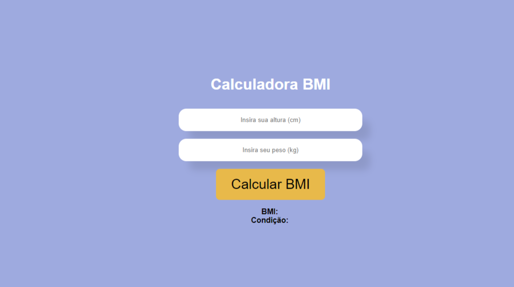

# Product Card

### Design

#

## Welcome! 👋

Thanks for checking out this front-end coding project.

**To do this challenge, I needed of React.js, HTML, CSS and JavaScript**.

#

## The project

The project aims to build this BMI Calculator and make it as responsive and intuitive as possible. The calculation is done through the weight and height informed by the user.

Your users must be able to:

- Preview the optimal layout for the website depending on your device's screen size.
- Calculate your BMI (Body Mass Index).
- See the condition your body is in (Underweight, Healthy, Overweight and Obesity).

## Deploy of my project

My project is hosted on Netlify in the link below:

- [Netlify](https://bmi-calculator-lapisco.netlify.app/)

## Built with

- Javascript
- Flexbox
- [React](https://reactjs.org/) - JS library
- HTML
- CSS
